<h1 align="center">Attune</h1>

<p align="center">
  <b>Pick a song you love. Get a playlist that sounds like it.</b><br>
  A Windows app for the music files you already own. No account, no cloud, no subscription.
</p>

<p align="center">
  <i>A modernized, spiritual successor to the long-abandoned MusicIP Mixer / MusicMagic.</i>
</p>

<p align="center">
  <a href="#get-it">Get it</a> &middot;
  <a href="docs/WALKTHROUGH.md">Walkthrough</a> &middot;
  <a href="#what-you-can-do-with-it">What it does</a> &middot;
  <a href="#from-source">From source</a> &middot;
  <a href="#how-it-works">How it works</a> &middot;
  <a href="docs/MUSICIP_HERITAGE.md">Heritage</a> &middot;
  <a href="#status-and-limits">Limits</a>
</p>

<p align="center">
  
  
  
</p>

<p align="center">
  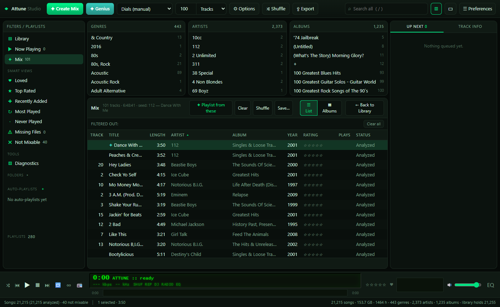
</p>

---

## What it is

Attune listens to every track in your music folder once, then lets you point at any song
and say "more like this". It's a desktop app. You install it, point it at a folder, and
leave it running the first time. After that, mixing is instant.

It matches on the actual **sound** of a track, not on genre tags and not on what other
people listened to. Two songs tagged "rock" can sound nothing alike, and Attune knows the
difference because it listened to both.

Everything happens on your machine. Nothing is uploaded and there is no account to make.

## Get it

1. Download **AttuneSetup-0.1.0.exe** from the [Releases page](https://github.com/Maestro8484/attune/releases).
2. Run it. It installs for you alone, in your own user folder, so Windows won't ask for an
   administrator password.
3. Windows will show a blue box saying **"Windows protected your PC"**. Click **More info**,
   then **Run anyway**. That happens because the file isn't code-signed, and signing means
   paying a company to vouch for a one-person free project. The warning tells you nothing
   about this particular file either way, only that nobody has paid to vouch for the
   publisher. It also won't go away with time, and it comes back on every future version.
   If you'd rather not trust a stranger's executable, the whole source is here and you can
   build it yourself.
4. There's also a portable zip on the same page if you'd rather not install anything. Unzip
   it and run `Attune.exe` out of the folder.

To check your download against `SHA256SUMS.txt`, in PowerShell:

```
Get-FileHash .\AttuneSetup-0.1.0.exe -Algorithm SHA256
```

### First run

<p align="center">
  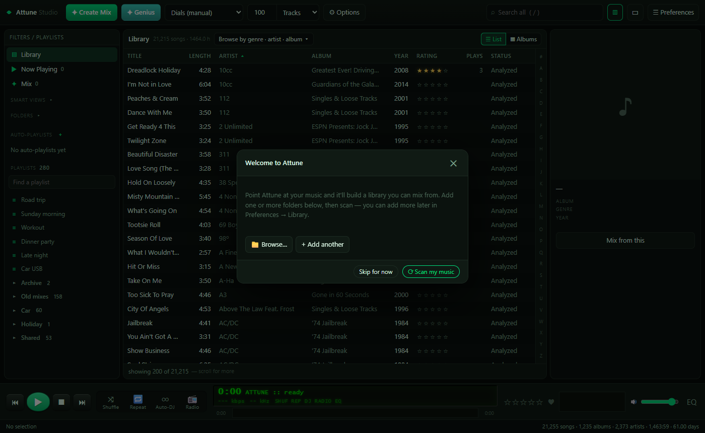
</p>

A window called **Welcome to Attune** opens. Press **Browse...** and pick your music
folder, **+ Add another** if your music lives in more than one place, then **Scan my music**.

The scan reads your files and listens to each one. This is the slow part and it only happens
once per track. A big collection takes hours. It runs in the background and picks up where
it left off.

**Start mixing** appears when the scan has finished, not part way through, so on a big
library that is the end of the wait rather than the middle of it. Press it, click any track
in the list, and press **Create Mix**.

The click-by-click guide, including getting a mix onto a USB stick and into Plex, is in
**[docs/WALKTHROUGH.md](docs/WALKTHROUGH.md)**.

## What you can do with it

- **Mix from one song.** Click a track, press Create Mix, get a playlist that sounds like it.
  Five sliders say what "similar" is allowed to mean: **CLAP** for the sound itself,
  **Timbre**, **Genre**, **Tempo** and **Era**, with **Presets** if you would rather not
  fiddle. Two tick boxes, **MMR variety** to stop it picking near-identical tracks and
  **Flow ordering** to arrange the result rather than just rank it.
- **Radio.** An endless queue that keeps going, with an energy shape you pick: flat, rising,
  falling, or a wave.
- **Blend.** Give it two or more songs and it mixes toward the middle of them.
- **Adventure.** Give it a start and an end, and it builds the path between them.
- **Genius.** One button. It picks the starting song for you: something you loved and haven't played
  lately if it can, then something you rated highly, then anything analysed.
- **Recipes.** Save a set of mix settings under a name and use it again.
- **Auto-Playlists.** Rules instead of a starting song: artist, genre, year, rating, tempo and more.
- **Browse and play.** Search, album and folder views, album art, ratings, loved tracks, tags.
- **Copy a mix to a USB stick.** Numbered filenames so a car stereo plays them in order, tags
  intact, either flat or as Artist / Album folders.
- **Save a playlist file.** `.m3u8`, readable by MusicBee, foobar2000, Plex, anything.
- **Push a mix into Plex,** and mirror a folder on disk to a Plex playlist that stays in step
  with it.
- **Repair a library.** Find tracks whose files have moved or gone, and relink them.

<p align="center">
  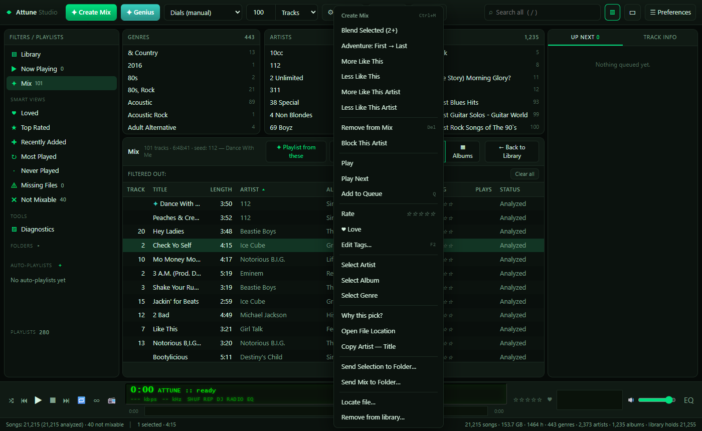
</p>

<p align="center">
  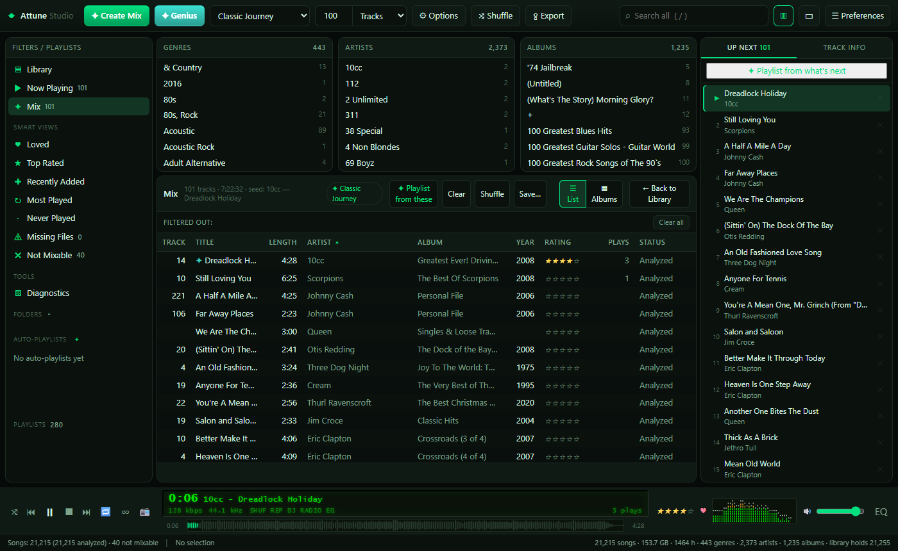
</p>

<p align="center">
  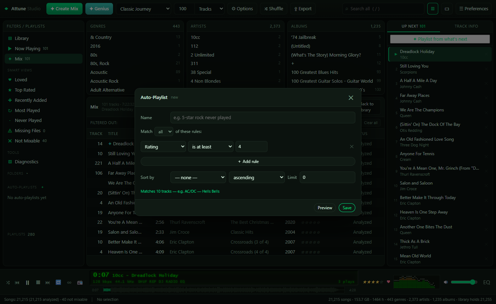
</p>

<p align="center">
  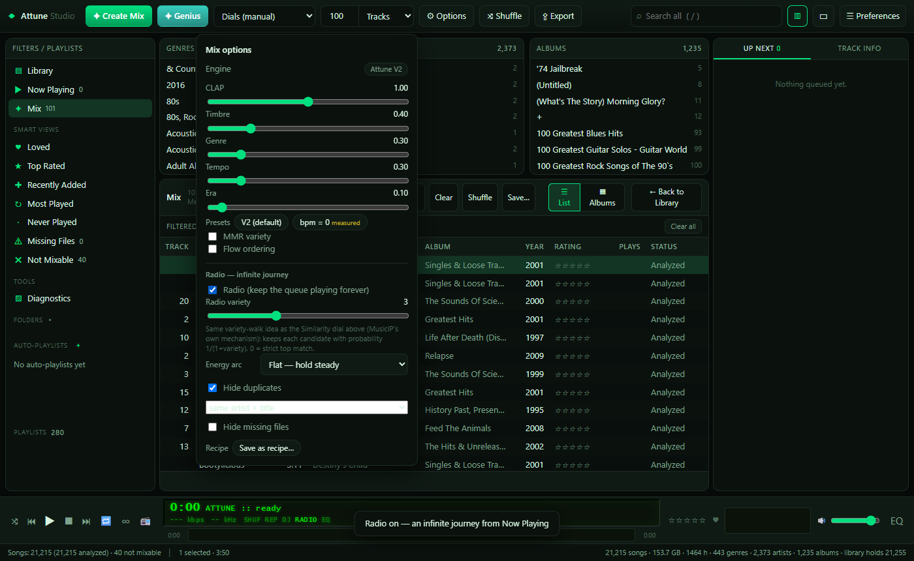
</p>

<p align="center">
  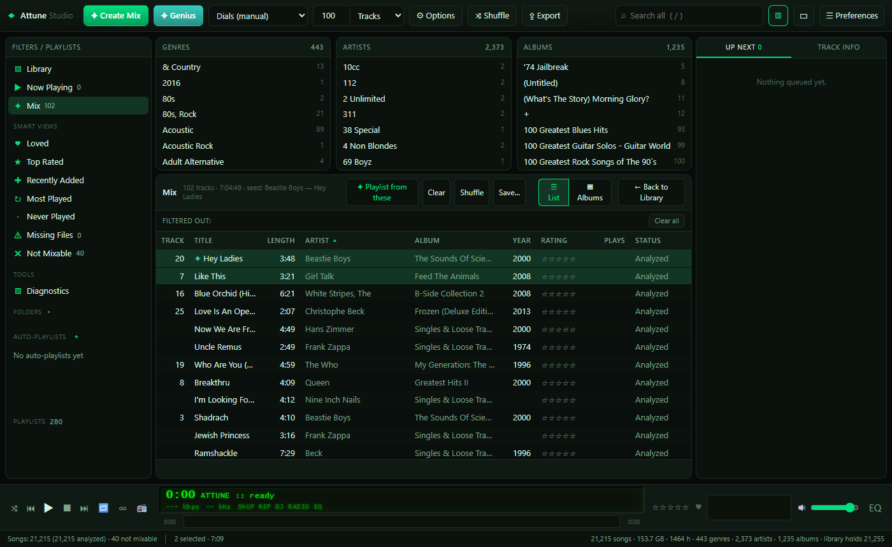
</p>

<p align="center">
  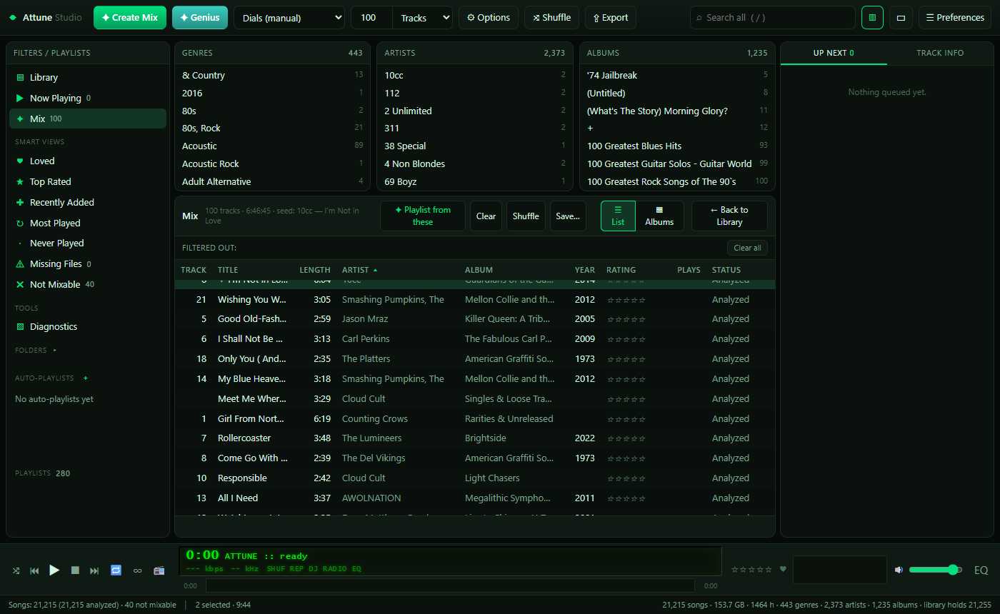
</p>

<p align="center">
  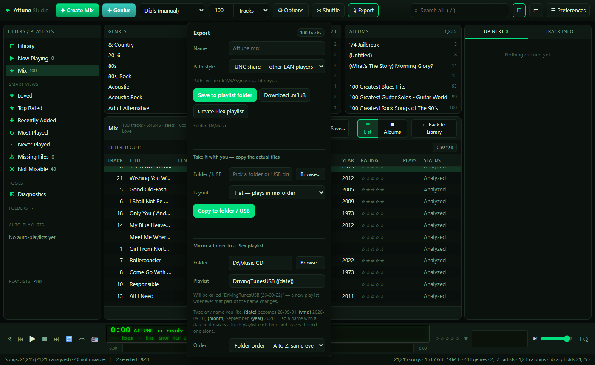
</p>

<p align="center">
  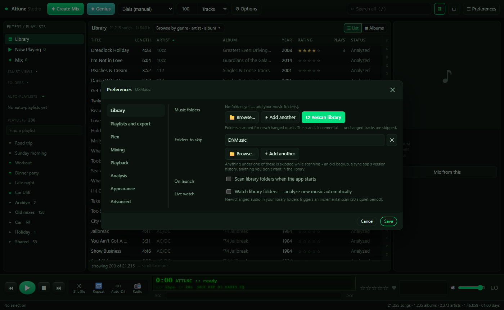
</p>

<p align="center">
  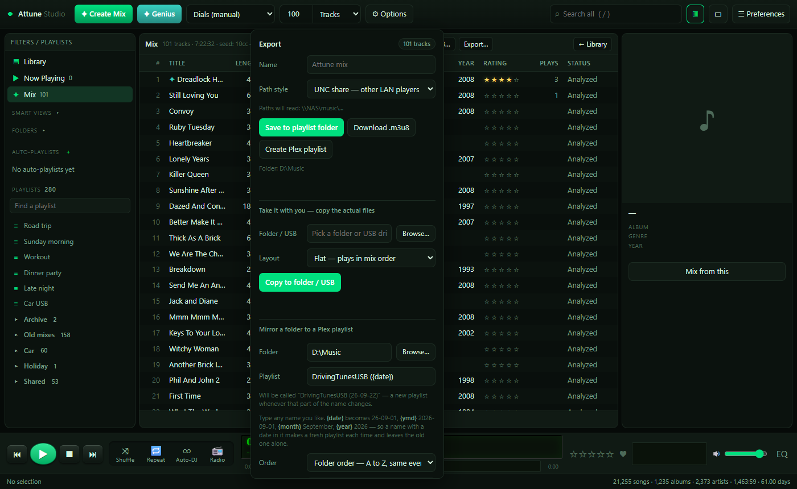
</p>

## Why this exists (a true story)

My car plays MP3s straight off a USB stick, by file and folder. So do my kids' music
players, and the boombox. It's the most solid, dependable music setup I've ever owned:
your files, your devices, no cloud middleman, no subscription, nothing to break.

The missing piece was always the *playlist brain*. **MusicIP Mixer** (2005 to 2010) was that
brain: hand it one song and it built a playlist of tracks that were *acoustically similar*,
not "fans also liked", not tag matching, but actual **sound**. Then the company folded and it
became abandonware. Those of us who kept it alive paid a tax for it: getting one mix onto a
USB stick meant MusicIP, then export (it only speaks 2000s Winamp), then save `.m3u`, then
import into MusicBee, then rebuild the playlist, then export the files to a folder, then copy
to the stick. Five steps til Sunday, for every single mix, for fifteen years.

Attune ends that. Pick a song, get the mix, press one button, pull the stick out of the port.
And when the old engine finally won't run anywhere, Attune's own open-source analysis engine
is here to outlive it.

> **Why not just use an audio fingerprinter like Chromaprint or AcoustID?** Because those
> answer *"is this the exact same recording?"*, which is identification. Attune answers
> *"what else sounds like this?"*, which is similarity. Different problem, different maths.
> The distance between the fingerprints of two different songs means nothing at all.
> [More on this below](#how-it-works).

## Where Attune sits

There are other ways to do this and they suit different setups. Each licence below was read
off that project's own repository page on 2026-09-21; check it again before relying on it,
because licences change and this paragraph will not:

- **[AudioMuse-AI](https://github.com/NeptuneHub/AudioMuse-AI)** (AGPL-3.0) is the closest in
  spirit. It's a self-hosted service you run in Docker or on a server, and it plugs into
  Navidrome, Jellyfin, LMS, Lyrion, Emby and Plex. If your music already lives behind a media
  server, start there.
- **[bliss-rs](https://github.com/Polochon-street/bliss-rs)** (GPL-3.0) is a Rust library that
  computes similarity from hand-crafted spectral features, with a Lyrion/LMS plugin built on
  it. No neural model.
- **Plex** has its own sonic analysis and sonically similar playlists. It's closed source and
  needs a Plex Pass.
- **beets** is the reference tool for tagging and identifying a library. That's a different
  job from "what sounds like this".

Attune's lane is the one none of those fill: a plain Windows app for files sitting on a disk.
No server to run, no container, no subscription.

## From source

Full instructions are in **[INSTALL.md](INSTALL.md)**. The short version, on Python 3.10 or
newer:

```
git clone https://github.com/Maestro8484/attune.git
cd attune
python -m venv .venv
.venv\Scripts\activate
pip install -e .[app]
python tools/fetch_model.py
```

Install the `[app]` extra, not the bare package. `onnxruntime` lives only in the extras, so
a bare `pip install -e .` cannot load the model the next line downloads.

`tools/fetch_model.py` downloads the 263 MiB audio model, which isn't kept in the repository
so that a clone stays small. It checks the download against a pinned SHA-256 and puts it
where the code expects it.

## How it works

Every track gets listened to once and turned into two things:

- A **CLAP embedding**: 512 numbers from a neural network trained on music. It's the closest
  thing anyone has to "what this sounds like" in a form a computer can compare.

<p align="center">
  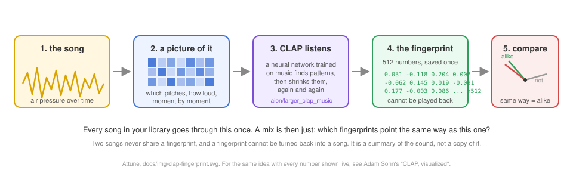
</p>

Think of the 512 numbers as a fingerprint of the sound. It is a bit like a QR code, in that a
whole song is boiled down to a small block of data a machine can read in an instant, but with
one difference that is the whole point. A QR code stores a message exactly, so a reader gets
the same text back every time. A CLAP fingerprint stores a *summary*: it cannot be turned back
into the song, and two different songs that sound alike get fingerprints that point in nearly
the same direction. That is what makes "more like this" a single comparison rather than a
guess. If you want to watch every step of that with real numbers on screen, Adam Sohn's
[CLAP, visualized](https://adamsohn.com/clap/) follows one sound all the way through the
model, and it is the best explanation of it I have seen.
- A **79-number acoustic descriptor** from classic signal processing: timbre (MFCC), harmony
  (chroma), spectral contrast, texture, and tempo.

The default **engine**, meaning the part that picks the songs, ranks candidates mostly on
the CLAP embedding, then adjusts with the descriptor and a few plain musical facts:
timbre, genre overlap, how far apart the tempos are, and how far apart the years are.
Those adjustments are what stop an ears-only neural match from jumping across tempo and
decade in a way that sounds wrong.

That combination came out ahead of genuine MusicIP in a listening test I sat myself, and it
was more than a quick listen. Think of a multiple-choice exam. Each question is one song. The
answer choices are the playlists that five to seven different song-matchers built from that
song, the real MusicIP among them, and instead of ticking one you rank them all, best to
worst, by ear. A paper is five questions. I sat about twenty papers: over a hundred questions,
five to seven playlists each, several hundred playlists heard through and ranked. Part of
every paper was blind: MusicIP and the other outside matchers were shuffled and unlabelled,
my own were labelled, so this is a partly blind test and I say so. One paper is written up in
full on the [engines page](docs/ENGINES.md); the rest were sat the same way. Five songs on
one paper is not enough to call a winner, so I don't; twenty papers was enough that I stopped
needing MusicIP. The exact weights it comes with are the ones that came out ahead. Two ideas that sound clever and lost by ear are deliberately
switched off in the default: matching keys around the circle of fifths, and folding tempo
octaves so that 87 and 174 BPM count as the same. Both are in the code and both are off. The
reasoning is written into `src/hybrid.py` beside the weights themselves.

The whole library lives in one SQLite file. No database server, no vector database, no
containers. See [docs/ARCHITECTURE.md](docs/ARCHITECTURE.md) and
[docs/ENGINES.md](docs/ENGINES.md).

## Privacy

Nothing leaves your machine unless you set up Plex yourself. Attune makes exactly two kinds
of outbound call and both are to machines you control: your own Plex server, at the address
you typed into Preferences, and a MusicIP Mixer on `localhost` if you happen to still run
one. There's no telemetry, no analytics, no update check and no account.

The one exception worth naming is the from-source model download, which talks to GitHub once.

Details, with the file and line behind each claim, in [docs/PRIVACY.md](docs/PRIVACY.md).

## Status and limits

Attune is v0.1.0. It's the app its author uses every day on a library of over twenty thousand
tracks, and this is the first release anybody else can install. Expect rough edges.

- **Windows 10 or 11 only** for now. The engine is plain Python and portable, but the app,
  the installer and the USB drive detection are not. The window needs Microsoft's WebView2
  runtime, which Windows 11 and most updated Windows 10 machines already have; if yours
  does not, Attune says so at startup and names the download.
- **The installer isn't code-signed,** so Windows shows a warning on first run and will keep
  showing it on every future version. See [Get it](#get-it).
- **The first analysis is slow.** Every track has to be listened to. Hours for a large
  collection, once, in the background.
- **It's a big download.** Most of it is the model that does the listening. The exact size is
  on the Releases page.
- **Your music files have to stay where they are.** Attune stores paths, and playback and
  album art read the file off disk. If a drive is unplugged those tracks won't play, though
  mixing still works.
- **No automatic updates.** Download a newer version and install over the top.
- **Formats:** mp3, flac, m4a, aac, ogg, opus, wma and wav. The decoder for the awkward ones
  is bundled, so there's nothing for you to install.

Interfaces may shift before 1.0. Issues and pull requests are welcome, see
[CONTRIBUTING.md](CONTRIBUTING.md) and [SECURITY.md](SECURITY.md).

`eval/` holds research scripts used while tuning the engine. They aren't part of the product
and you don't need them to run it.

## Licence

Attune's own source is **MIT**, see [LICENSE](LICENSE).

The **built application** is a different answer, because it bundles other people's work. Some
of that work is GPL, so the installed program as a whole is conveyed under
**GPL-3.0-or-later**. For you as a user that changes nothing: run it, for anything, forever,
and you owe nobody anything. For anyone redistributing the built app, the GPL's conditions
come along with it. The full reasoning, and every bundled component with its licence, is in
**[NOTICE.md](NOTICE.md)**.

"MusicIP" and "MusicMagic" are third-party marks, referenced here only to describe heritage
and interoperability. Attune is not affiliated with or endorsed by their rights holders, and
contains none of their code. Attune analyses audio files you already have; it neither copies
nor distributes music.

## Credit

Attune stands on the shoulders of the MusicIP community, who kept a dead program alive for
over a decade. Particular thanks to the Logitech Media Server plugin authors, `lms-mipmixer`
among them, who documented the local API and proved the idea still had legs long after the
company that built it had gone.

What MusicIP was, why it died, and what Attune keeps and drops from it:
**[docs/MUSICIP_HERITAGE.md](docs/MUSICIP_HERITAGE.md)**. How Attune's output was measured
against it: **[docs/VALIDATION.md](docs/VALIDATION.md)**.

The code here was written with Claude Code, Anthropic's coding tool, working from my
direction. What Attune should do, what it should refuse to do, and every call about
whether a playlist actually sounded right are mine. The listening tests were run on my
own ears and my own library, and no number was ever allowed to overrule them.

---

<p align="center"><sub>Built for people who miss the days when your computer actually understood your music.</sub></p>
